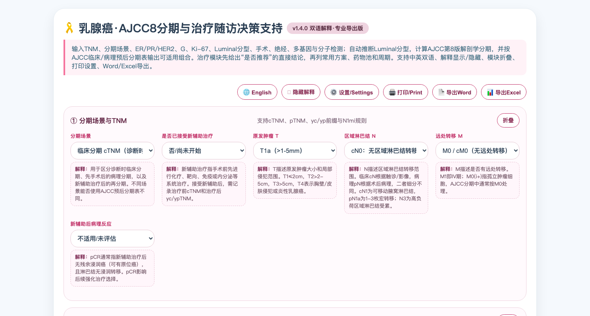
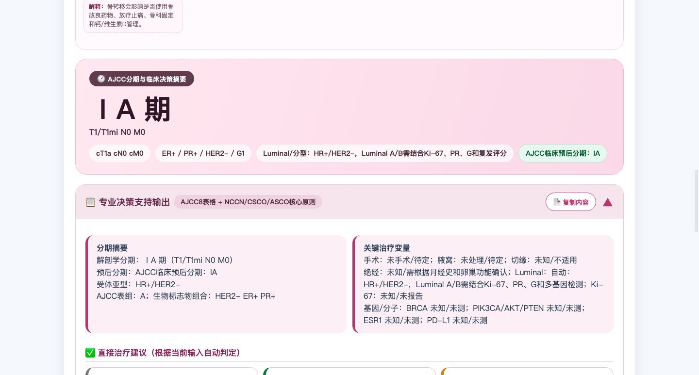

<div align="center">
  
  <h1>Breast TNM Tool</h1>
  <p><strong>AJCC 8th breast cancer anatomic/prognostic staging and treatment follow-up decision support, with desktop, desktop web, and mobile web delivery.</strong></p>
  <p>
    <a href="README.zh-CN.md">简体中文</a> | <strong>English</strong>
  </p>

  <p>
    <a href="https://github.com/liqi3333/breast/releases/latest"></a>
    <a href="https://github.com/liqi3333/breast/releases"></a>
    <a href="https://github.com/liqi3333/breast/actions/workflows/build-windows.yml"></a>
    <a href="https://github.com/liqi3333/breast/actions/workflows/release.yml"></a>
  </p>

  <p>
    <a href="https://liqi3333.github.io/breast/"></a>
    <a href="https://liqi3333.github.io/breast/mobile.html"></a>
    <a href="https://github.com/liqi3333/breast/releases/latest"></a>
    <a href="https://github.com/liqi3333/breast/releases/latest"></a>
  </p>
</div>

## Overview

This repository packages a single-file clinical interface for breast cancer staging and treatment support into three delivery forms:

- Windows portable EXE
- desktop standalone HTML / GitHub Pages web app
- mobile standalone HTML

The latest desktop web update is **v1.4.0**, focused on AJCC 8th edition staging and richer treatment follow-up decision support.

## What's new in the latest desktop web version

- AJCC 8th **anatomic staging** plus **clinical/pathologic prognostic staging**
- Scenario-aware inputs for **cTNM / pTNM / ycTNM / ypTNM**
- Biomarker-driven interpretation for **ER / PR / HER2 / grade / Ki-67 / Luminal subtype**
- Treatment and follow-up output aligned to core **NCCN / CSCO / ASCO** principles
- Built-in **bilingual explanations**, collapsible modules, print settings, and **Word / Excel export**
- Updated screenshots and release documentation

## Online HTML Version

- Desktop web: <https://liqi3333.github.io/breast/>
- Mobile web: <https://liqi3333.github.io/breast/mobile.html>
- Latest release: <https://github.com/liqi3333/breast/releases/latest>

## Screenshots

### Main interface



### Decision support panel



## Quick Start

### Download

From the latest release you can download:

- Windows EXE
- desktop standalone HTML
- mobile standalone HTML

### Run locally

```bash
npm install
npm start
```

### Build Windows portable EXE

```bash
npm install
npm run build:win
```

### Build standalone HTML package

```bash
npm run build:html
```

Build outputs:

```text
dist/Breast-TNM-Tool-1.4.0.exe
dist-html/Breast-TNM-Tool-1.4.0.html
dist-html/Breast-TNM-Tool-mobile-1.4.0.html
```

## Release Automation

- Push to `main`: runs build validation and uploads EXE + desktop HTML + mobile HTML workflow artifacts
- Push a tag like `v1.4.0`: automatically builds the Windows x64 portable EXE, generates standalone HTML assets, creates a GitHub Release, and uploads all files

Example:

```bash
git tag v1.4.0
git push origin v1.4.0
```

## Release Notes Template

```text
docs/RELEASE_TEMPLATE.md
```

## Project Structure

```text
.
├── assets/
│   ├── icon.ico
│   ├── icon.png
│   └── screenshots/
├── docs/
│   └── RELEASE_TEMPLATE.md
├── scripts/
│   ├── build-html-release.js
│   └── capture-screenshots.js
├── index.html
├── mobile.html
├── main.js
├── package.json
├── README.md
├── README.zh-CN.md
└── .github/workflows/
    ├── build-windows.yml
    └── release.yml
```

## Notes

- `node_modules/`, `dist/`, and `dist-html/` are not committed
- Windows SmartScreen may appear because the EXE is not code signed
- Medical content is for informational use only and does not replace formal diagnosis or clinical decision-making
